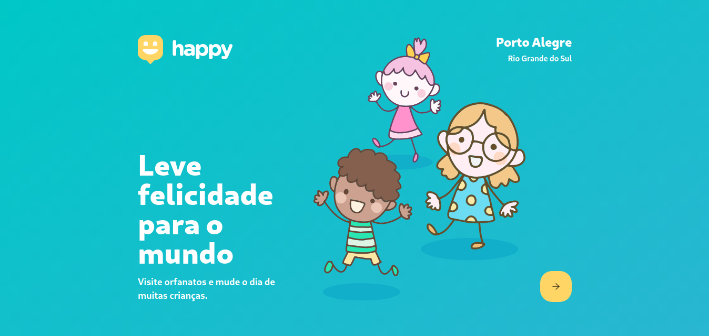
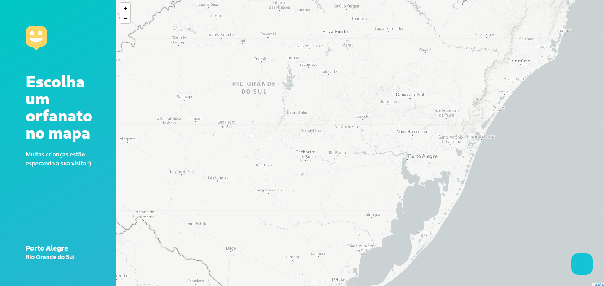

<body background="#000">
  <!--
    personal badges => https://simpleicons.org/?q=react 
    badges => http://shields.io/
  !-->
  <header>
    

      
      
      
      
      
      
    

     
    <h1 align="center">
      
    </h1>
    
 ⚛️ 📄 🚀

    
Happy is a project for connecting Orphanages and Persons

    

      <a href="#about">About</a>
      <!-- <a href="#features">Features</a> -->
      <a href="#preview">Preview</a>
      <a href="#requirements">Requirements</a>
      <a href="#-technologies">Technologies</a>
      <a href="#-contributing">Contributing</a>
      <a href="#-license">License</a>
    

     
     
        

      
      
      
      
      
    

  </header>

   
 

  <main>
    <section id="about">
      <h3>Sobre</h3>
      
O Happy é um projeto que que visa conectar pessoas e orfanatos. Muitas pessoas não vistam ou não conhecem orfanatos por falta de informação, muitas vezes. Nesse sentido, o Happy tem como foco informar as pessoas sobre localização de orfanatos, horários de visitas e muito mais...

    </section>
     
 
    <section>

- 
    </section>

     
 

    <h3>Apenas um preview</h3>
    

    <section id="preview" align="center">
      
       
      
    </section>

     
 

    <section id="requirements">
      <h3>Requerimentos</h3>
      
Antes de começar, você vai precisar instalar as seguintes ferramentas: 

      
<a href="https://git-scm.com">• Git</a>

      
<a href="https://nodejs.org/en/">• Node.js</a>

      
<a href="https://code.visualstudio.com/">• VSCode</a>

    </section>

     
 

    <h3>🎲 Run project on Back-end:</h3>
    <code>

      # Clone this repository
      $ git clone <https://github.com/rwietter/happy.git>

      # Access the project folder in the / cmd terminal
      $ cd proffy

      # Navigate to server
      $ cd backend

      # Install dependences
      $ yarn install

      # Run the application in development mode
      $ yarn dev

      # The server starts at port 3333 - go to http://localhost:3333

    </code>

     
 

    <h3>🎲 Run project on web:</h3>
    <code>

      # Clone this repository
      $ git clone <https://github.com/rwietter/happy.git>

      # Access the project folder in the / cmd terminal
      $ cd proffy

      # Navigate to server
      $ cd web

      # Install dependences
      $ yarn install

      # Run the application in development mode
      $ yarn start
      
      # The server starts at port 3333 - go to http://localhost:3000

    </code>

     
 

    <h3>🎲 Run project on mobile:</h3>
    <code>

      # Clone this repository
      $ git clone <https://github.com/rwietter/happy.git>

      # Access the project folder in the / cmd terminal
      $ cd proffy

      # Navigate to server
      $ cd mobile

      # Install dependences
      $ yarn install

      # Run the application in development mode
      $ yarn start
      
      # The server starts at port 3333 - go to http://localhost:19002

      # Download the expo on your phone and scan the QRCODE

    </code>

     
 

    <section id="technologies">
      <h3>🛠 Technologies</h3>
      <!-- 
As seguintes ferramentas foram usadas na construção do projeto:
 -->
      
<a href="https://www.typescriptlang.org/">• TypeScript</a>

      
<a href="https://nodejs.org/en/">• NodeJS</a>

      
<a href="http://knexjs.org/">• KnexJS</a>

      
<a href="https://pt-br.reactjs.org/">• ReactJS</a>

      
<a href="https://reactnative.dev/">• React Native</a>

      
<a href="https://expo.io/">• Expo</a>

    </section>

     
 

    <section id="contributing">
      <h3>🌐 Contributing</h3>

  - Fork this repository;
  - Create a branch with your feature: `git checkout -b my-feature`
  - Commit your changes: `git commit -m 'feat: My new feature'`
  - Push your branch: `git push origin my-feature`
    </section>

     
 

    <section id="license">
      <h3>📝 License</h3>
      <a href="./LICENSE">This project is under the MIT license. See the LICENSE for more details.</a>
    </section>

     
 

    

      <h3>Layout</h3>
      <a href="https://www.figma.com/file/mDEbnoojksG4w8sOxmudh3/Happy-Web/duplicate?node-id=0%3A1">Happy</a>
    

     
 

    <footer id="author" align="center">
      
<a href="https://twitter.com/rweitter">@rwietter</a>

    </footer>

  </main>

---
  <footer align="center">
    

      <strong>Projeto desenvolvido durante a Next Level Week by RocketSeat</strong>
    

    

      <strong>Project developed for study purposes.</strong>
    

  </footer>
</body>
